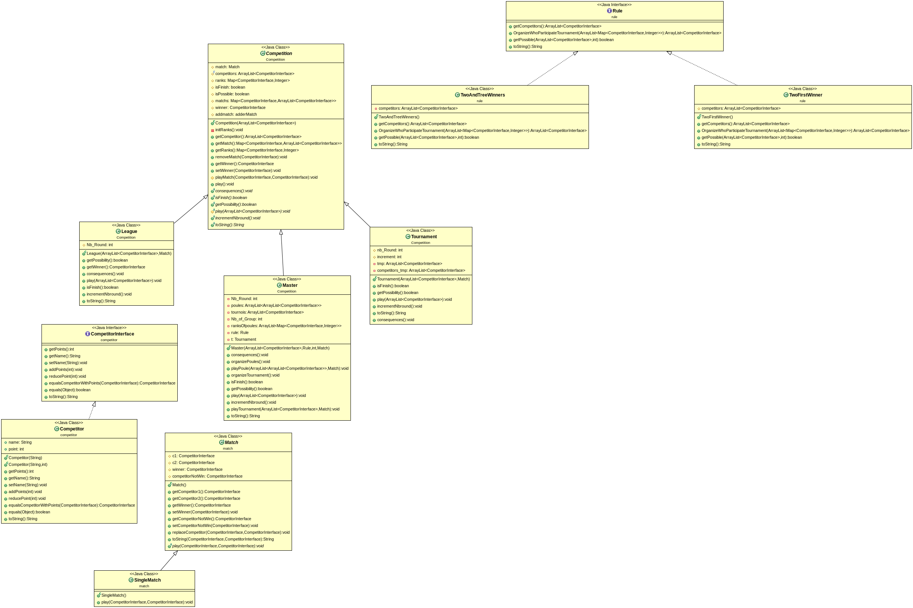

# L3 Projet Competitions sportives


## Binôme

* Alpha Oumar BARRY
* Yao Isidore AMEVIGBE

<h2>Table des Matieres</h2>

1. [Objectif du projet](#objectifs)
2. [Organisation de Projet](#organisation)
3. [How To](#howTo)
4. [Conception de l'application](#conception)
5. [UML du projet](#projet)

## 1. Objectifs du Projet <a name="objectifs"></a>

Ce projet a pour objectif principal, la conception et le developpement d'une application de gestion de competitions sportives basés sur les connaissances acquises au cours de **Programmation Orienté Objet** du semestre 3, et celles qui seront acquises au cours de **Conception Orienté Objet** de ce semestre (semestre 5).

Cette application sera dévéloppée au fur et à mesure de l'évolution du cahier des charges fournis à ce <a href="https://www.fil.univ-lille1.fr/~quinton/coo/projet/competitions.pdf">lien</a>.

## 2. Organisation du dépôt <a name="organisation"></a>

```console
├── assets
│   ├── cleaned
│   └── loading
├── classes
├── docs
├── jar
│   ├── league.jar
│   ├── manifest-MainLeague
│   ├── manifest-MainMaster
│   ├── manifest-MainTournament
│   ├── master.jar
│   └── tournament.jar
├── Makefile
├── README.md
├── src
│   ├── Competition
│   │   ├── Competition.java
│   │   ├── League.java
│   │   ├── Master.java
│   │   └── Tournament.java
│   ├── competitor
│   │   ├── CompetitorInterface.java
│   │   └── Competitor.java
│   ├── exception
│   │   ├── CompetitorQuantityException.java
│   │   ├── NoCompetitorException.java
│   │   ├── NoPointException.java
│   │   └── RanksException.java
│   ├── Main
│   │   ├── LeagueMain.java
│   │   ├── MasterMain.java
│   │   └── TournamentMain.java
│   ├── match
│   │   ├── Matches.java
│   │   ├── Match.java
│   │   └── SingleMatch.java
│   ├── rule
│   │   ├── Rule.java
│   │   ├── TwoAndTreeWinners.java
│   │   └── TwoFirstWinner.java
│   └── util
│       ├── adderForLeague.java
│       ├── adderMatch.java
│       ├── addMatchForTournament.java
│       ├── Colors.java
│       ├── makerListCompetitor.java
│       ├── MapUtil.java
│       ├── RandomU.java
│       └── StdDisplay.java
├── test
│   ├── Competition
│   │   ├── CompetitionTest.java
│   │   ├── CompetitionTestWithMock.java
│   │   ├── LeagueTest.java
│   │   ├── MasterTest.java
│   │   ├── MockCompetition.java
│   │   └── TournamentTest.java
│   ├── competitor
│   │   ├── CompetitorTest.java
│   │   └── MockCompetitor.java
│   ├── match
│   │   ├── MatchTest.java
│   │   ├── MockMatchs.java
│   │   └── SingleMatchTest.java
│   └── rule
│       ├── RuleTest.java
│       ├── TwoAndTreeWinnersTest.java
│       └── TwoFirstWinnerTest.java
└── UML
    ├── projet_uml.ucls
    ├── projet_uml_v1.png
    └── projet_uml_v2.png

18 directories, 54 files
```

## 3. HowTo <a name="howTo"></a>

Clonage du dépôt
----------------

Pour recupérer le dépôt, il faut éxécuter la commande suivante,

En https :

```sh
$ git clone https://gitlab-etu.fil.univ-lille1.fr/amevigbe/l3-projet-competitions-sportives.git
```

Ou en SSH :

```sh
$ git clone git@gitlab-etu.fil.univ-lille1.fr:amevigbe/l3-projet-competitions-sportives.git
```

Génération de la documentation
------------------------------

Pour générer la javadoc du projet, on se place dans la racine du projet et on éxécute la commande suivante :

```sh
$ make docs
```

Pour la visualiser, on éxécute cette commande depuis la racine du projet,

```sh
$ make view-docs
```

Compilation et éxécution des tests
----------------------------------

Concernant les tests, on a utilisé la verson Junit 5 pour les faire mais n'ayant pas trouvé de jar pour les compiler depuis le terminal, on les a éxécuté sur un editeur intégré (eclipse).

Mais on peut utiliser pour les éxécuter en éxécutant la commande suivante depuis la racine du projet :

```sh
$ mvn test
```

Compilation du code source
--------------------------

Pour la compilation du code source, on doit se placer dans la racine du projet et éxécuter la commande suivante :

```sh
$ make cls
```

Exécution des mains des competitions
------------------------------------

Après la compilation de l'ensemble du code source, on a besoin de voir l'éxécution des mains du code source.

Pour l'éxécution du main de chaque competition on se place dans le **dossier classes** après compilation et on éxécute les commandes suivantes : 

pour le main de la **Competition League**,

```sh
$ make playLeagueGame <<NBRE_COMP=nombre_de_competiteurs>>
```

pour le main de la **Competition Tournament**,

```sh
$ make playTournamentGame <<NBRE_COMP=nombre_de_competiteurs (puissance de 2)>>
```

pour le main de la **Competition Master**,

```sh
$ make playMasterGame <<NBRE_COMP=nombre_de_competiteurs>> <<NBRE_POULES=nombre_de_competiteurs>>
```

Attention
---------

Pour gérer le main de master, on n'a choisi d'utiliser la methode de selection **TwoFirstWinners** (voir dans la partie 4.3) donc pour que le code s'éxécute avec succès on est obligés de mettre des nombres puissance de 2 aux paramètres NBRE_COMP ET NBRE_POULES, sachant que NBRE_COMP est au moins 4 fois supérieur à NBRE_POULES, comme montré dans lES exempleS en dessous.

Exemple de commandes d'éxécution
--------------------------------

```sh
$ make playTournamentGame NBRE_COMP=8
```

```sh
$ make playLeagueGame NBRE_COMP=8
```

```sh
$ make playMasterGame NBRE_COMP=16 NBRE_POULES=4
$ make playMasterGame NBRE_COMP=8 NBRE_POULES=2
$ make playMasterGame NBRE_COMP=16 NBRE_POULES=2
$ make playMasterGame NBRE_COMP=32 NBRE_POULES=16
```

Création et éxécution des fichiers .jar
---------------------------------------

Pour la création et l'éxécution de l'archive de chaque main de competition on se place à la racine du projet et on éxécute les commandes :

Competition League
------------------

**Création** :

```sh
$ make league.jar
```

**Exécution** :

```sh
$ java -jar jar/league.jar <nombre_de_joueurs>
```

Competition Tournament
----------------------

**Création** :

```sh
$ make tournament.jar
```

**Exécution** :

```sh
$ java -jar jar/tournament.jar <nombre_de_joueurs (Puissance de 2)>
```

Competition Master
------------------

**Création** :

```sh
$ make master.jar
```

**Exécution** :

```sh
$ java -jar jar/master.jar <nombre_de_joueurs> <nombre_de_poules>
```


## 4. Présentation d'éléments de code saillants <a name="conception"></a>

4.1 Classes Matchs|Match|SingleMatch
------------------------------------

En appliquant les principes **SOLID (Ségragation d'interface et Inversion des dépendances)**, on a jugé nécéssaire de créer une interface **Matchs** qui fait implementer la classe abstraite **Match**, et la classe **SingleMatch** hérite de la classe abstraite.

Cette implémentation a été choisie pour que d'autres classes de bas niveaux (classe fille) ne force pas les classes de hauts niveaux à être modifiées.

En plus, avec cette conception, nous pouvons en rajouter d'autres types de matchs juste en héritant de la classe abstraite sans la modifier (principe OPEN/CLOSE).

Ainsi cela empêche la modification de methodes au cours d'un prolongement du projet.


4.2 Classes CompetitorInterface|Competitor
------------------------------------------

On a choisi de faire implementer la classe **Competitor** de l'interface **CompetitorInterface**, pour une même raison que **Match** c'est à dire nous pouvons créer d'autres types de personnage pour les **Competition**, comme par exemple les spectateurs d'un match,...

4.3 Classes Rule|TwoFirstWinner|TwoAndTreeWinners
-------------------------------------------------

Les classes **Rule|TwoFirstWinner|TwoAndTreeWinners** represente le type de selection utilisé pour accéder à la deuxième phase de la competition master.

**Rule** : une interface

**TwoFirstWinner** : une première methode de selection des joueurs.

Cette methode de selection se présente comme suit : elle divise 16 joueurs en 4 poules de 4 joueurs et ne conserve que les deux meilleurs de chaque poule pour la seconde phase.

**TwoAndTreeWinners** : une deuxième methode de selection des joueurs.
Cette methode de selection se présente comme suit : elle divise 16 joueurs en 4 poules de 4 joueurs et ne conserve que les deux meilleurs de chaque poule pour la seconde phase.

**NB :** pour la classe rule on a utilisé le **design pattern strategy**, car on peut utiliser plusieurs methodes de selections pour la séconde phase de master (Tournoi).

4.4 Classes Master
------------------

Cette classe represente la nouvelle competition démandée dans la version 2 du sujet, elle hérite de la classe Competition.


4.5 Implémentation des Journalistes et Bookmakers
-------------------------------------------------

Concernant la dernière version du projet, on a utilisé le design pattern **Observer**, dont une partie du code est déjà fournie, on a adapté notre code à ce code.

Exemple de traces d'éxécution de la competition master avec 8 competiteurs reparties en 2 poules
------------------------------------------------------------------------------------------------

```console
Saisissez le nom du compétiteur A
Saisissez le nom du compétiteur B
Saisissez le nom du compétiteur C
Saisissez le nom du compétiteur D
Saisissez le nom du compétiteur E
Saisissez le nom du compétiteur F
Saisissez le nom du compétiteur G
Saisissez le nom du compétiteur H

***************play Master **************

***************Affichage d'une poule****************

[A, B, C, D]
B vs A --> A wins
B vs C --> B wins
B vs D --> D wins
D vs A --> A wins
D vs B --> D wins
D vs C --> D wins
A vs B --> B wins
A vs C --> C wins
A vs D --> D wins
C vs A --> C wins
C vs B --> C wins
C vs D --> C wins

** Ranking **
D ---> 4
C ---> 4
B ---> 2
A ---> 2

***************Affichage d'une poule****************

[E, F, G, H]
G vs E --> G wins
G vs F --> F wins
G vs H --> H wins
F vs E --> F wins
F vs G --> G wins
F vs H --> H wins
H vs E --> H wins
H vs F --> F wins
H vs G --> G wins
E vs F --> F wins
E vs G --> G wins
E vs H --> E wins

** Ranking **
G ---> 4
F ---> 4
H ---> 3
E ---> 1

****Voici les joueurs qualifiés pour la phase finale****

[D, C, G, F]


******************** Jeu Tournois ***********
D vs C --> C wins
G vs F --> F wins
C vs F --> C wins
************************* C Wins ****************
***************Fin du Master**********************
```

## 5. UML du projet <a name="projet"></a>

Voir l'image suivante, pour le diagramme UML de cette version du projet.


